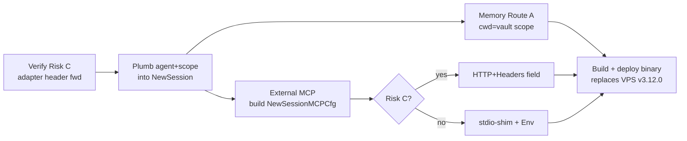

# 25. ACP Native-Tools & MCP Passthrough (Design)

> Status: **Design / not yet implemented**. Produced 2026-06-18.
> Scope: make the ACP provider expose (1) GoClaw's native memory tools and
> (2) the agent's configured external MCP servers to the spawned ACP agent
> (Claude Code via `@agentclientprotocol/claude-agent-acp`), so an ACP-backed
> agent has the same recall/write + MCP reach as a native-provider agent.

## 1. Problem

When an agent runs through the **ACP provider** (e.g. `e-smith-hub` now on
`acp-claude` → Opus 4.8), GoClaw delegates the whole turn to the ACP subprocess.
GoClaw's own tool-call loop does **not** run (`v3.run.completed … iterations=0`).
The subprocess only has the ACP `ToolBridge` filesystem/terminal tools, sandboxed
to the provider `work_dir`.

Concretely, `internal/providers/acp/session.go:NewSession()` sends:

```go
req := NewSessionRequest{ Cwd: cwd, MCPServers: []NewSessionMCPCfg{} } // always empty
```

Consequences for an ACP-backed agent:

| Capability | Native provider | ACP today |
|---|---|---|
| Per-turn auto-injected memory index (`## Memory Context`) | ✅ | ✅ (it's prompt text in `req.Messages`) |
| Interactive recall (`memory_search` / `memory_get` / `read_file` / `list_files`) | ✅ | ❌ not exposed |
| Inline memory write (`write_file` to `MEMORY.md` / topics / journal) | ✅ | ❌ not exposed |
| Agent's external MCP servers (e.g. `odoo-prod`) | ✅ | ❌ not exposed |

Long-term memory still accumulates via the **background curation cron**
(reads conversation history from DB → writes vault), which is provider-independent.
But the agent itself cannot deep-recall or self-write under ACP, and cannot reach
the Odoo MCP.

## 2. Goal

At ACP `session/new`, populate `MCPServers` so the ACP agent connects back to:

1. **GoClaw native tools** — at minimum the memory + filesystem subset already
   exposed by the MCP bridge (`memory_search`, `memory_get`, `read_file`,
   `write_file`, `list_files`).
2. **The agent's granted external MCP servers** — resolved per agent from the DB.

…with the correct **scope** (agent / user / channel / chat / peer) and **auth**
flowing through, so memory operations land in the right vault scope and external
servers authenticate.

## 3. What already exists (load-bearing)

- **MCP bridge server** — `internal/mcp/bridge_server.go:NewBridgeServer`, mounted
  at `/mcp/bridge` (`internal/gateway/server.go:200-213`) as a
  `StreamableHTTPServer`. Exposes a **filtered** tool set via `BridgeToolNames`
  (`bridge_server.go:18-51`) which already includes `memory_search`, `memory_get`,
  `read_file`, `write_file`, `list_files`.
- **Bridge scope + auth** — `tokenAuthMiddleware` (Bearer = `Gateway.Token`) +
  `bridgeContextMiddleware` (`gateway/server.go:225-318`) which reads scope from
  **HTTP headers** `X-Agent-ID / X-User-ID / X-Channel / X-Chat-ID / X-Peer-Kind /
  X-Session-Key / X-Workspace / X-Local-Key` and verifies an HMAC `X-Bridge-Sig`
  via `providers.VerifyBridgeContext` (`gateway/server.go:254`). `makeToolHandler`
  (`bridge_server.go:97-122`) re-injects that scope into each tool call through
  `reg.ExecuteWithContext(...)`.
- **MCP server config store** — `internal/store/mcp_store.go`. `MCPServerData`
  (`:12-28`) carries `Name, Transport(stdio|sse|http), Command, Args, URL, Headers,
  Env, APIKey, ToolPrefix, TimeoutSec, Settings, Enabled`. Per-agent grants via
  `MCPAgentGrant` + `ListAccessible(ctx, agentID, userID)` returning `MCPAccessInfo`
  (server + effective tool allow/deny).
- **ACP session MCP type** — `internal/providers/acp/types.go:88-97`:

  ```go
  type NewSessionMCPCfg struct {
      Name    string            `json:"name"`
      URL     string            `json:"url,omitempty"`
      Command string            `json:"command,omitempty"`
      Args    []string          `json:"args,omitempty"`
      Env     map[string]string `json:"env,omitempty"`
      // NOTE: no Headers field.
  }
  ```
- **Adapter capability** — `claude-agent-acp@0.47.0` advertises
  `mcpCapabilities:{http:true, sse:true}` on `initialize`, i.e. it can connect to
  HTTP/SSE MCP servers declared in `session/new`.

## 4. Gaps

### Gap A — `NewSession` has no agent/scope/MCP data
`NewSession` is on `ACPProcess`; the `ProcessPool` is keyed by binary and only
holds `sessionKey` (opaque). At `process.go` spawn → `NewSession(ctx)` the ctx is
freshly created and carries no agent ID, tenant, scope, or MCP list. The data
exists upstream in `ACPProvider.Chat/ChatStream` (which has the `ChatRequest`
context) but is not threaded down.

Call chain: `ACPProvider.Chat → pool.GetOrSpawn(sessionKey) → spawn → proc.NewSession`.

### Gap B — `NewSessionMCPCfg` has no `Headers`
HTTP MCP entries can carry only `name` + `url`. The bridge needs
`Authorization: Bearer <token>`, the `X-*` scope headers, and `X-Bridge-Sig`.
External HTTP MCP servers (`odoo-prod`) need their own auth headers
(`MCPServerData.Headers`). Neither is expressible today.

### Risk C — does the adapter forward custom headers? (unverified)
`mcpCapabilities.http=true` confirms HTTP MCP support, but whether
`claude-agent-acp` actually **sends per-server custom auth headers** declared in
`session/new` is not verified. This gates the HTTP-vs-stdio decision (§6).

## 5. Memory: two routes

Memory can be solved **independently** of the external-MCP work, and there is a
simpler option than the bridge.

### Route A — `cwd` = scope vault dir (recommended for memory)
Set the ACP session `Cwd` to the conversation's vault scope directory
(`<vaultDir>/<scope>`, scope from `tools.MemoryVaultSubdirFor(channel,peerKind,
chatID,userID)`). The ACP agent then uses its **own** `Read/Write/Glob/Grep/Edit`
on the Obsidian markdown directly:
- deep recall = read `topics/*.md`, `journal/*.md`;
- "remember X" = append to `MEMORY.md`.

Pros: no bridge, **no Gap B, no Risk C**, leverages Claude's native markdown
fluency. The per-turn `## Memory Context` injection still provides the entry index.

Cons: loses GoClaw's `WrapUntrustedMemory` wrapping and scope-enforcement (the
agent could read sibling scopes if the sandbox root is the vault root); requires
the ACP `ToolBridge` sandbox to permit that directory (today it is pinned to the
provider `work_dir`). Mitigation: set the **sandbox root** to the vault root and
`Cwd` to the scope subdir, accept read-within-vault.

### Route B — memory via the MCP bridge
Treat the bridge as one of the injected MCP servers (see §6). Keeps GoClaw scope
logic and untrusted-wrapping; pays Gap B + Risk C. Choose this only if we want a
single uniform mechanism for memory + external MCP.

**Recommendation:** Route A for memory; bridge/MCP machinery reserved for external
servers. Revisit B if scope-enforcement on memory turns out to matter.

## 6. External MCP passthrough (`odoo-prod`)

No shortcut — external servers must be declared as `session/new` MCP entries.
Two transports:

### Option HTTP+Headers
Add `Headers map[string]string` to `NewSessionMCPCfg`; map
`MCPServerData.{URL,Headers,APIKey}` into it. Requires **Risk C = true** (adapter
forwards headers). Cleanest wire shape if supported.

### Option stdio-shim (header-gap-proof)
Ship a tiny stdio MCP proxy binary. Declare external/bridge servers as
`{Command: shim, Args:[--target,<url>], Env:{AUTH…, X_AGENT_ID…}}`. `Env` **is**
supported by `NewSessionMCPCfg`, so auth + scope ride through env and the shim adds
the headers when calling the real HTTP endpoint. Sidesteps Gap B and Risk C
entirely, at the cost of a new shim component + process per server.

**Decision:** verify Risk C first (§8). If headers forward → HTTP+Headers. Else →
stdio-shim (or, for the GoClaw bridge specifically, the shim is trivial since it
only ever targets `localhost/mcp/bridge`).

## 7. Implementation plan (phased)



### Phase 1 — plumbing (Gap A)
- Thread `agentID, userID, tenantID, scope(channel/chatID/peerKind/sessionKey)` and
  a resolved `[]NewSessionMCPCfg` from `ACPProvider.Chat/ChatStream` down through a
  new `GetOrSpawnWithSession(...)` (or attach to a per-sessionKey cache the pool
  reads in `spawn`). Files: `internal/providers/acp_provider.go`,
  `internal/providers/acp/process.go`, `internal/providers/acp/session.go`.
- `NewSession` gains params `(cwd string, mcp []NewSessionMCPCfg)`.

### Phase 2 — memory (Route A)
- Compute scope vault dir via `tools.MemoryVaultSubdirFor(...)`; pass as `Cwd`.
- Widen ACP `ToolBridge` sandbox root to the vault root (or scope dir). Files:
  `internal/providers/acp/terminal.go` / wherever the sandbox root is enforced.

### Phase 3 — external MCP
- In `ACPProvider.Chat`, call `MCPServerStore.ListAccessible(ctx, agentID, userID)`;
  map each `MCPAccessInfo.Server` → `NewSessionMCPCfg` (respect `ToolAllow/ToolDeny`
  if the adapter supports per-server tool filtering; else document the limitation).
- Add the GoClaw bridge as one entry (`http://localhost:<gwPort>/mcp/bridge`) if we
  also want native tools over MCP (Route B); otherwise skip when using Route A.
- Implement HTTP+Headers **or** stdio-shim per Risk C outcome.
- Header set for the bridge: `Authorization: Bearer <Gateway.Token>` +
  `X-Agent-ID/X-User-ID/X-Channel/X-Chat-ID/X-Peer-Kind/X-Session-Key` +
  `X-Bridge-Sig` (compute with the same signer behind `VerifyBridgeContext`).

## 8. Risk-C verification (do first)
Minimal probe on the VPS adapter: start `claude-agent-acp`, `initialize`,
`session/new` with one HTTP MCP entry pointing at a throwaway local HTTP server
that logs inbound headers; `session/prompt` something that lists/uses its tools;
inspect whether the declared auth/custom headers arrived. Outcome selects HTTP vs
stdio-shim and unblocks Phase 3.

## 9. Affected files (index)

| Area | File(s) |
|---|---|
| Session/new shape | `internal/providers/acp/session.go`, `internal/providers/acp/types.go` |
| Spawn plumbing | `internal/providers/acp/process.go`, `internal/providers/acp_provider.go` |
| Sandbox root (Route A) | `internal/providers/acp/terminal.go` (sandbox enforcement) |
| Bridge + scope | `internal/mcp/bridge_server.go`, `internal/gateway/server.go:200-318` |
| Memory tools scope | `internal/tools/memory.go`, `internal/tools/vault_search.go`, `internal/store/context.go` |
| External MCP config | `internal/store/mcp_store.go`, `internal/mcp/manager.go` |
| Bridge HMAC signer | `internal/providers` (`VerifyBridgeContext` + its signing counterpart) |

## 10. Deployment note
The fork (`test/merge-main`) is **ahead** of the deployed VPS binary (`v3.12.0`,
which still sends `MCPServers []string{}` — pre-`NewSessionMCPCfg`). Shipping this
requires building from the fork and replacing the VPS binary, not just a config
change. Memory Route A can ship before the external-MCP work.

## 11. Open decisions
1. Memory via **Route A (cwd=vault)** or **Route B (bridge MCP)**? — default A.
2. After Risk-C: external MCP via **HTTP+Headers** or **stdio-shim**?
3. Expose the **full** `BridgeToolNames` set to ACP agents, or a memory-only
   subset (avoid handing Claude duplicate/conflicting fs/exec tools it already has)?
4. Per-server `ToolAllow/ToolDeny` enforcement when handing servers to the ACP
   agent — enforce in GoClaw, rely on adapter, or accept all?

## 12. ACP delegation gap inventory

§1–§11 address only **two slices** — interactive memory tools and external MCP
passthrough. They were never the whole story. The structural root cause is that an
ACP turn **delegates the entire agentic loop to the subprocess**: `ACPProvider.Chat`
returns no `ToolCalls` and no `Usage`, so `think_stage` breaks on iteration 0
(observed `iterations=0 total_tokens=0`), and GoClaw sends the subprocess only
`system prompt + last user message + that message's images`
(`extractFromMessages`, `claude_cli_session.go:117`). **Everything GoClaw's native
loop does — tools, history/compaction, accounting, hooks, permission gates, model
params, events — is bypassed.** This section enumerates the full set so each gap is
a deliberate decision, not an accident.

A code audit (2026-06-18, ~45 verified differences across 12 dimensions) classified
them into 13 categories. Disposition legend:

- **(a) bridge-MCP** — expose via the §6/§7 `session/new` MCP plumbing.
- **(b) inline** — fold into the flattened prompt as text at turn-build time (no
  tool loop needed).
- **(c) accept** — by-design unavailable on ACP; document the limitation.
- **(d) new-design** — needs its own design (subprocess-side wrapper / event bridge).

### Master table

| # | Category | Severity | Covered by §1–§11 | Recommended disposition |
|---|---|---|---|---|
| A | Native tool-call loop never runs (parallel exec, budget/read-only-streak, loop-kill, deferred-MCP activation) | critical | partial (symptom only) | (c) accept + document; revisit per-control |
| B | Whole native tool categories unreachable (web_search/fetch, media gen/analysis, browser, cron/datetime/heartbeat, message/group_members, sessions_*, forum) | critical | partial (memory subset) | (a) per-category bridge decision |
| C | Skills system lost (skill_search, use_skill→SKILL.md exec chain, bundled skills, skill_evolve/nudge, publish, skill ACL) | high | no | (b) inline SKILL.md / (a) skill-load tool |
| D | Subagents lost (spawn, delegate, team_tasks board, orphan-spawn counter; ACP subagent dies after one turn) | high | no | (d) new-design |
| E | Memory **writes** never reach `memory_documents`/`memory_chunks`; KG extraction + `kg_dedup`, leader-only write lock, overwrite warning lost | critical | no / partial | (a) bridge memory write **or** accept Route A files-only |
| F | Token / USD-cost / usage accounting always zero (budget rollup, episodic `token_count`, subagent stats, `model_fallback` no-retry) | high | no | (d) parse ACP usage if adapter emits it, else (c) |
| G | Hooks + security gates lost (PreToolUse/PostToolUse/UserPromptSubmit/Stop; injected security settings; coarse 3-way `permMode` only) | high | no | (d) subprocess-side gate / (c) accept |
| H | Model params ignored (thinking_level/effort, temperature, max_tokens, per-turn model override, StripThinking) | high | no | (b) settings.json model + (d) for params |
| I | MCP enforcement weak even when passed through (per-agent tool allow/deny, per-user creds, `require_user_credentials`, untrusted-wrapping) | high | partial | (a) enforce at bridge / (d) |
| J | Identity/ACL bypass (group file-writer gate by SenderID, `CredentialUserID` secure-CLI, UserID-scoped memory/cron/workspace) | high | no / partial | (a) thread identity headers / (c) restrict tools |
| K | Context management: only system+last-user-msg sent → GoClaw compaction/`context_pruning`/history does not drive ACP; continuity relies on subprocess session; respawn/idle-reap = amnesia | high | no | (b) replay compacted history on respawn / (c) |
| L | Multimodal: latest user image passes in; **historical** images and subprocess-produced media not surfaced | medium | no | (c) accept / (d) media bridge |
| M | Observability: subprocess tool call/result/media only `slog.Debug`'d, not turned into `AgentEvent`s or forwarded to the outbound bus | medium | no | (d) convert `ToolCallUpdate`→events |

### Category notes (evidence + decision rationale)

- **A — loop bypass.** `acp_provider.go` Chat/ChatStream read only text blocks;
  `PromptResponse` has no `ToolCalls` (`acp/types.go`); `think_stage.go` breaks at
  `len(ToolCalls)==0`. Even with §6 fully done the **subprocess** runs its own loop —
  GoClaw's parallelism, budget/read-only-streak, loop-kill, and deferred-MCP
  activation are gone. Default **(c)**: document as by-design; only re-impose a
  control if a concrete need appears.
- **B — tool categories.** ~40 native tools flow via `req.Tools`, which
  `extractACPContent` ignores; `ToolBridge` dispatches only fs/terminal/permission;
  `session/new` MCP is empty. §11 Q3 only debates the memory-vs-full *bridge* subset;
  it never inventories web/media/browser/cron/messaging/sessions/forum. Decide
  per-category — web_search/web_fetch and media likely warrant **(a)**.
- **C — skills.** `skill_search`/`use_skill`/`publish_skill`/`skill_manage` are
  native-loop tools, none in `BridgeToolNames`; the search-mode prompt tells the
  agent to call an uninvokable tool. Cheapest path is **(b)**: pre-inline relevant
  `SKILL.md` content at turn build; richer path is **(a)** a skill-load tool + widened
  sandbox. `skill.activated` observability is unrecoverable without a GoClaw-side
  tool event.
- **D — subagents.** `spawn` is explicitly excluded from `BridgeToolNames`;
  `delegate`/`team_tasks` unreachable; a spawned subagent that inherits an ACP
  provider ends after one text-only turn. This is the largest standalone gap →
  **(d)**.
- **E — memory writes (corrects §5).** §5 Route A (cwd=vault) lets Claude write
  markdown files, but those writes do **not** land in `memory_documents`/
  `memory_chunks`, skip KG extraction + `kg_dedup_config`, the leader-only write
  lock, and the overwrite-merge warning — so `memory_search`/`memory_get` will not
  find them. Route A is read-biased; durable, searchable writes need **(a)** the
  memory write tool over the bridge (which carries scope via headers). Vault
  enrichment otherwise survives only via the background curation cron.
- **F — accounting.** `PromptResponse` carries no token field; `Usage{}` zeroes
  per-turn usage, USD cost rollups, episodic `token_count`, and subagent stats;
  `model_fallback` does not retry ACP errors. If the adapter surfaces usage in
  `session/update`/result, parse it; else **(c)** and exclude ACP turns from cost
  reporting explicitly. *(Note: budget nudges and prune/compaction do not read
  `resp.Usage`, so they are unaffected.)*
- **G — hooks/security.** Lifecycle hooks and the injected PreToolUse security
  settings are loop-resident; ACP has no GoClaw-side tool boundary to host them, and
  `permMode` is a coarse approve-all/approve-reads/deny-all switch, not
  matcher/if_expr/handler. Highest-risk gap alongside I/J. **(d)** a subprocess-side
  gate, or **(c)** with a documented trust boundary.
- **H — model params.** Only a model **alias** reaches the subprocess (via
  `settings.json`); thinking_level/effort, temperature, max_tokens, per-turn override,
  and StripThinking do not apply. `Capabilities()` advertising `Thinking:true` is
  misleading for ACP. Model selection is **(b)** (done); the rest is **(d)** pending
  ACP protocol support for these knobs.
- **I — MCP enforcement.** Once the subprocess holds a direct long-lived MCP
  connection, GoClaw cannot interpose per-call to enforce `ToolAllow/ToolDeny`,
  per-user credentials / `require_user_credentials`, or wrap results as untrusted.
  Prefer **(a)** routing external MCP **through the bridge** so enforcement stays in
  GoClaw, rather than handing raw URLs to the subprocess.
- **J — identity/ACL.** The group file-writer gate (SenderID ACL), per-user
  `CredentialUserID` secure-CLI resolution, and UserID-scoped memory/cron/workspace
  actions are dropped because the subprocess acts without GoClaw's per-request
  identity context. Thread identity via bridge headers **(a)** or restrict the
  exposed tool set **(c)**.
- **K — context management.** `extractFromMessages` sends only the system message +
  the **last** user message (+its images); prior turns are not replayed. GoClaw's
  `compaction_config`/`context_pruning`/history assembly therefore do **not** drive
  the ACP turn — continuity depends entirely on the subprocess's own session
  (`acpSessions` reuse + `loadSession`). On idle-reap or process respawn the
  subprocess loses history while GoClaw resends only the last message → **silent
  amnesia** (this is exactly the `session/load failed, creating new session` seen in
  the LINE WORKS incident). Mitigation **(b)**: on respawn, replay the
  GoClaw-assembled (compacted) history into the new session; else **(c)** document.
- **L — multimodal.** `extractACPContent` forwards the latest user message's images
  only; historical images and any media the subprocess tools produce are not
  surfaced as attachments. **(c)** for input history; **(d)** for output media.
- **M — observability.** `ToolCallUpdate` notifications are logged at debug and
  discarded; no `AgentEventToolCall/Result`, no `forwardMediaToOutbound`. Convert
  `ToolCallUpdate`→`AgentEvent` and forward media **(d)** — independent of the
  memory/MCP work.

### Priority

Security/permissions first: **G, J, I** — today the ACP subprocess bypasses
GoClaw's permission, ACL, and credential-enforcement layers. Then capability
parity: **E** (searchable memory writes) and **K** (history continuity) most affect
day-to-day behaviour. **C/D/F/H/L/M** are feature/observability gaps to schedule or
formally accept. **A/B** are framed by §1–§7 already; close the remaining decisions
in §11.

